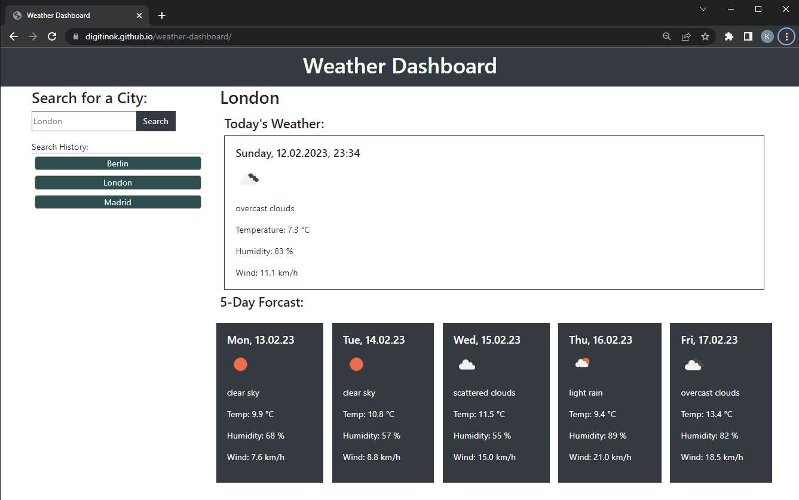

# Weather Dashboard

A Weather App

## Description

This project will present the user with a input field to search fro a city and display the current wether and a 5-day weather forcast.

### Repository

https://github.com/digitinok/weather-dashboard/

### Deployed Page

https://digitinok.github.io/weather-dashboard/

## Installation

This app will run in the browser, and will feature dynamically updated HTML and CSS powered by JavaScript code.

## Usage

The webpage will display the current weather and a 5-day weather forcast for a city searched in the input field.  The city will be stored in a search history in form of buttons. When this buttons are clicked, the current weather and forcast will be displayed for the associated city.

This is how the deployed pages looks like:

Screenshot of deployed Webpage

## Future Improvements

Furture improvements will include a clear button to reset the search list.

## Credits

N/A

## License

This project uses the MIT License. Please see the license file in the repositiry for fursther details.